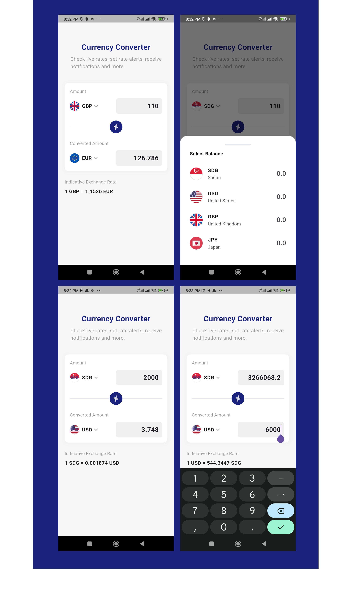

# Currency Converter App



A modern, user-friendly currency converter application built with Flutter that provides real-time currency conversion rates.

## Features

- Real-time currency conversion
- Support for multiple currencies (USD, EUR, GBP, JPY, SDG)
- Clean and intuitive user interface
- Live exchange rate display
- Bidirectional conversion
- Easy currency swapping
- Portrait mode optimization

## Tech Stack

- Flutter
- Riverpod (State Management)
- Dio (HTTP Client)
- Exchange Rate API (v6.exchangerate-api.com)

## Getting Started

### Prerequisites

- Flutter SDK
- Dart SDK
- An IDE (VS Code, Android Studio, or IntelliJ)
- API Key from exchangerate-api.com

### Installation

1. Clone the repository
```bash
git clone <repository-url>
```

2. Navigate to the project directory
```bash
cd ccapp
```

3.Install dependencies
```bash
flutter pub get
```
4. Run the app with your API key
```bash
flutter run --dart-define=API_KEY=your_api_key_here
```


## Features in Detail
- Live Currency Conversion : Real-time conversion rates from exchangerate-api.com
- Currency Input Cards : Customizable input fields for base and target currencies
- Currency Swapping : Easy swap between base and target currencies
- Error Handling : Robust error handling with user-friendly notifications
- Debounced API Calls : Optimized API usage with debounced currency conversion requests
## Contributing
Contributions are welcome! Please feel free to submit a Pull Request.

## License
This project is licensed under the MIT License - see the LICENSE file for details.